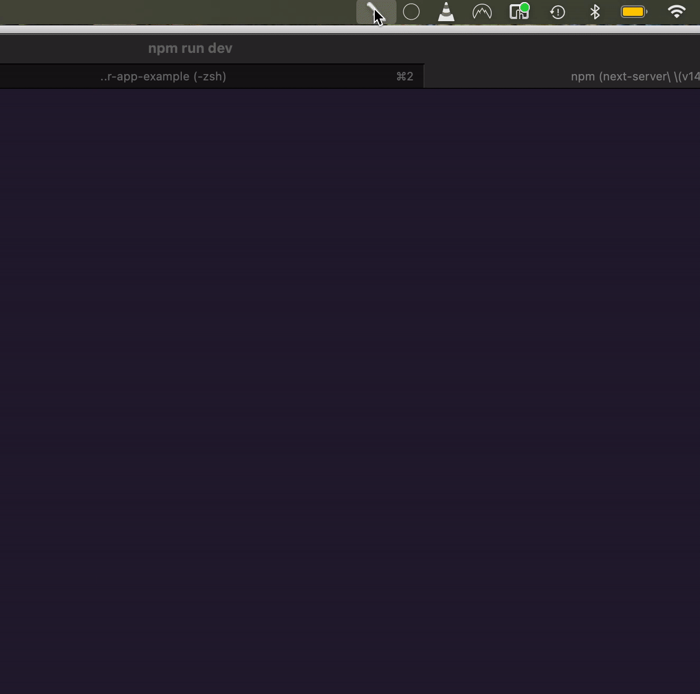

# Port Killer (macOS menubar, Tauri v2)



macOS menubar popover built with Tauri v2 + React. It lists every listening TCP port on your machine, shows the owning PID/command, lets you open the port in a browser, and can immediately kill any process bound to a port. The UI is styled with MUI and runs inside a non-activating NSPanel via `tauri-nspanel`.

## Features
- Menubar popover: tray icon toggles the panel; it hides when focus moves away so it behaves like a native menu.
- Port inventory: `lsof` + `ps` combine to list listening TCP ports with PID and command, sorted by port.
- Quick actions: click a port chip to open `http://localhost:<port>` (via `tauri-plugin-opener`); hit the kill button to send `kill -9` to any process on that port.
- Search and status: filter by port/PID/command, with loading/kill status indicators (⏳ / 💥) and auto-refresh when the popover regains focus.

## Requirements
- macOS (the menubar behavior relies on macOS-only private APIs).
- Node.js 18+ with [pnpm](https://pnpm.io) (corepack works fine).
- Rust toolchain (via [rustup](https://rustup.rs)) for building the Tauri side; Xcode Command Line Tools must be installed.
- No global Tauri CLI needed—the repo includes `@tauri-apps/cli`.

## Run the menubar app locally
```bash
pnpm install
pnpm tauri dev
```
- Vite runs on port 1420 (see `src-tauri/tauri.conf.json`), and the compiled app places a tray icon in the macOS menubar.
- Click the tray icon to show/hide the panel. Use the search box to filter, click a port chip to open it in your browser, or use the kill button to terminate the process bound to that port.
- Killing uses `kill -9`; ensure you have permission to terminate the target process.

## Build a release
```bash
pnpm tauri build
```
The bundle is written to `src-tauri/target/release/bundle/macos/`. Builds must run on macOS because of the private menubar APIs.

## Related
- [tauri-nspanel](https://github.com/ahkohd/tauri-nspanel/tree/main/examples/vanilla): converts a Tauri window into a non-activating menubar panel.

## License
MIT — see `LICENSE.md`.
